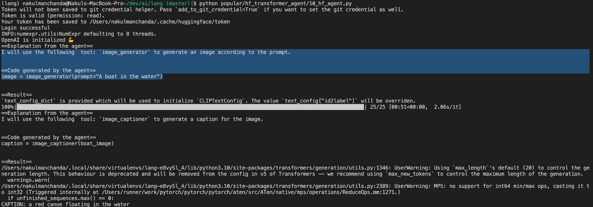

# Huggingace-Transformer Agent
[Twitter Thread](https://twitter.com/huggingface/status/1656334778407297027?s=20)

## Google Colab from Hugging face
https://colab.research.google.com/drive/1c7MHD-T1forUPGcC_jlwsIptOzpG3hSj

## Blog tutorial
https://towardsdatascience.com/hugging-face-transformers-agent-3a01cf3669ac

## Motivation
Can we use LLMs to decide which model to use, write code, run code, and generate results?

## Using Agent to generate python code
- For a completion of task we need to choose right tooling
- First order of business for this agent is choose appropriate tooling
- Then use python execution environment to generate and run code.
